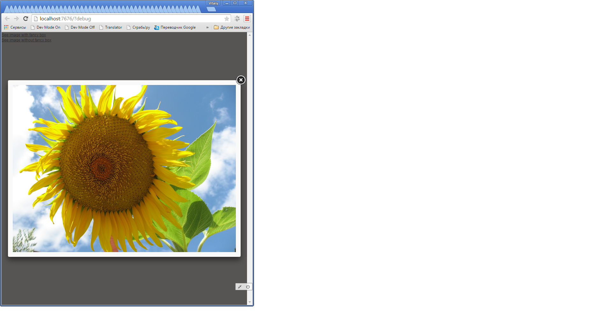

Vaadin wrapper for [fancy box 2 library](http://fancyapps.com/fancybox/#docs)



##Usage

Add JQuery library to your project, if it does not has yet. For example, like this:
```
@JavaScript({
        "//code.jquery.com/jquery-2.1.3.min.js"
})
public class YourUI extends com.vaadin.ui.UI {
  //...
}
```
And then you can use addon: 
```
        Link link = new Link(
                "Click Me",
                new ExternalResource("//www.jail.se/hardware/digital_camera/canon/ixus_800is-powershot_sd700/images/sample_photos/sample3.jpg")
        );
        new Fancybox(link).setPadding(0).setVersion("2.1.5");
        addComponent (link);
```
By default fancybox loads from cdnjs.cloudflare.com/ajax/libs/fancybox, you can set different url, use Fancybox#setCdnPath(String cdnPath) method

##Build and Development

```./gradlew idea``` - Intelij IDEA project files generation

```./gradlew :demo:vaadinRun``` - run embedded jetty server

```./gradlew :addon:publish``` - build and publish to maven repository, see more into build.gradle publishing.repositories.maven

If you need debug client side, you can use GWT SuperDev mode, run
code server ```./gradlew :demo:vaadinSuperDevMode``` and server ```./gradlew :demo:vaadinRun```  